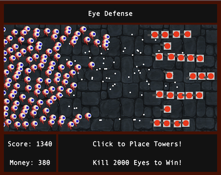
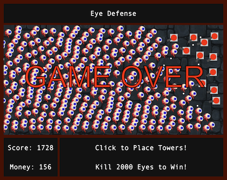

# ProjectOneGame
==========================================================

SEI 802 Project 1: Eye Defense



A simple tower defense game built by Cal Clemmer

To play Eye Defense online, visit https://calclemmer.github.io/ProjectOneGame/

# How to Play
==========================================================

The Eyes are attacking! If an Eye makes it to the right side of the screen, it's game over. Click on the screen to place towers to fight off the monsters! Place the towers wisely, it costs $100 to place a tower. Watch out, if an eye touches a tower it'll destroy the tower. Kill Eyes to get more money, build towers to protect yourself, and keep the ever growing hoards of Eyes at bay.  
  
Press P to Pause/Unpause 

Kill 2000 Eyes to Win!  
  



This is what losing looks like

# How to Install 
==========================================================
1. <code>Fork</code> and <code>Clone</code> this repository to your local machine 
2. Open index.html in a browser to play 

# Some Code Snippets
==========================================================

1.  <b>Aiming the Turret</b><br>
This method on the turret class finds the closest enemy, then calculates the angle between the turret and that enemy. This calculated angle is set as the "aimAngle"<br>
    ```javascript
    aim() {
        let closestEnemy = findClosest(this.x, this.y, arrTriangles);

    // magic to find angle 

        if (closestEnemy !== undefined) {
        this.aimAngle = Math.atan2(closestEnemy[1] - (this.y+15), closestEnemy[0] - (this.x+15));
        } else {
            this.aimAngle = Math.PI;
        }

        // this code lets it complete the circle! Otherwise turret will never cross the Pi rad (180 degree) angle, and spin the other way around instead even when that path is far longer
        // Essentially we're trying to keep the angle between 0 and 2PI rad

        if ((this.aimAngle + 2*Math.PI - this.angle) < Math.PI) {
            this.aimAngle += 2*Math.PI;
        } else if ((this.aimAngle - 2*Math.PI + this.angle) > Math.PI) {
            this.aimAngle -= 2*Math.PI;
        }
    }
    ```

2. <b>Rotating the Turret Barrel</b> This code, part of the render class on the turret, adjusts the angle of the turret barrel to match up with the aim angle. It has a coarse aim that quickly moves the turret barrel and a fine aim that more precisely lines up the barrel. 

```javascript 
         // coarse aim 
        if (this.angle + 0.04 < this.aimAngle) {
            this.angle += 0.04;
        } else if (this.angle - 0.04 > this.aimAngle) {
            this.angle -= 0.04;

        // fine aim 
        } else if (this.angle + 0.004 < this.aimAngle) {
            this.angle += 0.004;
        } else if (this.angle - 0.004 < this.aimAngle) {
            this.angle += 0.004;
        }
```

3. <b>Despawning Off Screen Projectiles</b><br>
If projectiles could continue off the screen forever, the game would quickly come to a laggy stop. To prevent this, this simple function checks if a given object's x or y position place it off screen and despawns it if it is. 
  
```javascript 
function despawn(arr) {
    for (let i = 0; i < arr.length; i++) {
        if (
            arr[i].x < -50 || arr[i].x > 950 
            ||
            arr[i].y < -50 || arr[i].y > 460
        ) {
            arr.splice(i, 1);
            i--;
        }
    }
}
```  

4.  <b>Spawning New Enemies</b><br>  
   
   Enemies are an integral part of the game, and the game difficulty increases by increasing the rate at which enemies spawn. Whenever the global count is a multiple of the frequency, the game attempts to spawn an Eye at a random Y coordinate slightly off screen. After picking a spawn location, the game checks to make sure no other Eyes are too close to that location to prevent overlapping. If there is overlapping, the game will repeat the process up to 10 times to try to find a suitable spot. If no spot is found, the game simply won't spawn the eye.  
     
   At extremely high spawn rates, the game allows the eyes to spawn slightly closer together. 

```javascript 
function spawnRandomTriangles(frequency) {
    if (frequency > 100) {
        frequency = 100;
    }
    if (frequency < 1) {
        frequency = 1;
    } else {
        frequency = Math.round(frequency);
    }

// Allows eyes to spawn closer together at high spawn rates  
    let distanceLimit = 29;
    if (frequency <= 2) {
        distanceLimit = 23;
    }

    if (globalCount % 100 === 0) {
        console.log(frequency);
    }
    
    if (globalCount % frequency === 0) {
        let escape = 0;
        // new Triangle(x, y, color, width, speed))
        const triangle = new Triangle(-25, Math.random()*400 + 20, '#228B22', 21, 1);

        while (escape < 10) {
            if (findClosest(triangle.x + 11, triangle.y + 9, arrTriangles, 'distance') > distanceLimit || arrTriangles.length === 0) {
                escape = 10;
                arrTriangles.push(triangle);
            } else {
                triangle.y = Math.random()*400 + 20;
                escape ++;
            }
        
        }
    
    }
}
```

5. <b>Hit Detection</b><br> 
 
 Hit detection is an essential part of this game, and the game is constantly checking if objects have collided. The function first checks to make sure that there is at least one Turret and at least one Eye. The function then checks if an Eye has an x position and y position that cause it to overlap with the turrets. If there is an overlap, both the Eye and the Turret are destroyed. This collision check is repeated for all turrets and all eyes.   

 A very similar collision check is used to check if any bullets have collided with any turrets.
   
```javascript
   function detectTurretHit() {
    if (arrTurrets.length > 0 && arrTriangles.length > 0)
    for (let i = 0; i < arrTurrets.length; i++) {
        for (let j = 0; j < arrTriangles.length; j++) {
            if (arrTurrets[i] && arrTriangles[j].x) {
            if (arrTurrets[i].x < arrTriangles[j].x + arrTriangles[j].length &&
                arrTurrets[i].x + 30 > arrTriangles[j].x &&
                arrTurrets[i].y + 30 > arrTriangles[j].y - 18 &&
                arrTurrets[i].y < arrTriangles[j].y + 2
                ) 
                {
                    arrTurrets.splice(i, 1);
                    arrTriangles.splice(j, 1);
                }
            }
        }
    }
}
```
